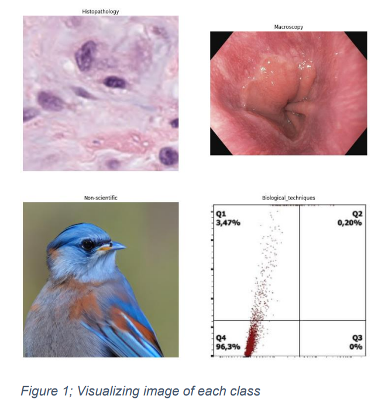
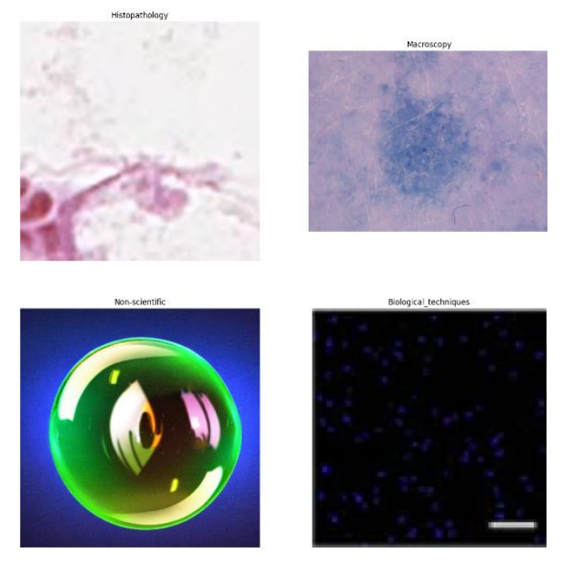
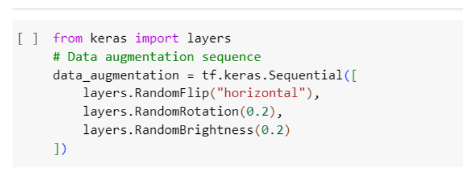
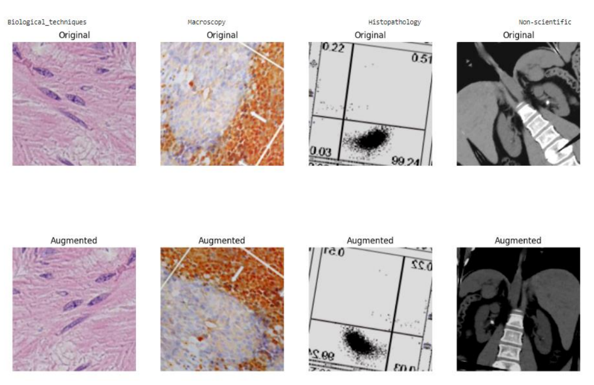
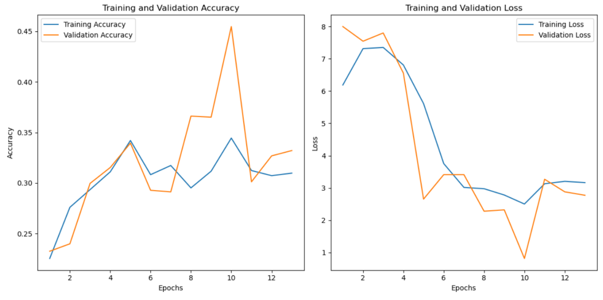
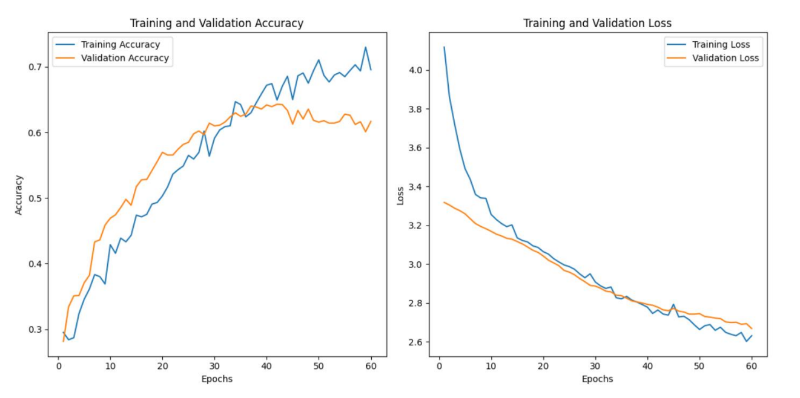
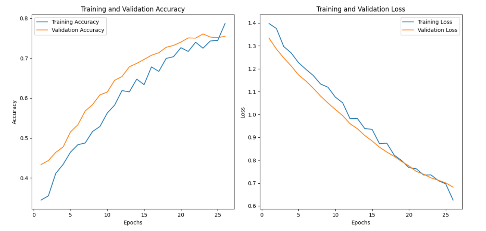

# Scientific-Image-Classification

## Introduction
Image classification is a fundamental task in computer vision that involves categorizing 
the images based on predefined classes and labels with the help of their visual content.
In recent years, advancements in deep learning, hardware enhancements like powerful 
GPUs have enable revolutionized the tasks like image classification with high accuracy 
and faster processing. We have performed the task of scientific image classification, 
with three different techniques. Further information about the datasets and approaches 
of this study is given below

## Data Description
The datasets consist of total 4 category. It has various scientific images including 
Biological_techniques, Histopathology, Macroscopy, and one Non-scientific categories.
The description of each class is given below.
1. Biological_techniques - This class consist the combination of other three class, 
Blot-Gel, FACS and Microscopy. We did this to handle the imbalance sets. And 
they were also quite similar that it didn’t effect our model much. 
2. Histopathology: These images provide information about tissue morphology, 
cellular architecture, and pathological features, also aids in the diagnosis and 
treatment of various medical conditions.
3. Macroscopy: This is high-resolution images of cellular structures or microscopic 
organisms, captured using various microscopy techniques.
4. Non-scientific: These images are unrelated to scientific research, it consist image 
like humans, dog, building and so on.

## Data Visualization 

## Data Augmentation 
 
Using TensorFlow and Keras, this code snippet defines a data augmentation sequence 
for image data. It applies random rotations of up to 20% (in degrees), random flips in the 
horizontal direction, and random brightness adjustments of up to 20%. In this project, 
ImageDataGenerator is used to generate more training data from existing images and 
also various transformation like rotation, flipping is applied. This helps to make the 
model more robust and prevents overfitting.

##Visualizing image after data augmentation 
 

## Performance of Normal Neural Network 
 

## Performance of CNN 

## Performance of Transfer Learning 

## Conclusion
Transfer > CNN > NN